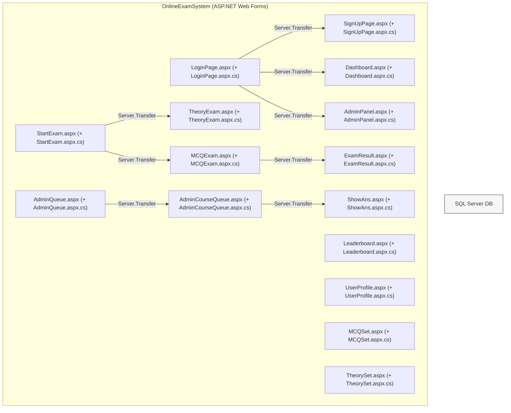
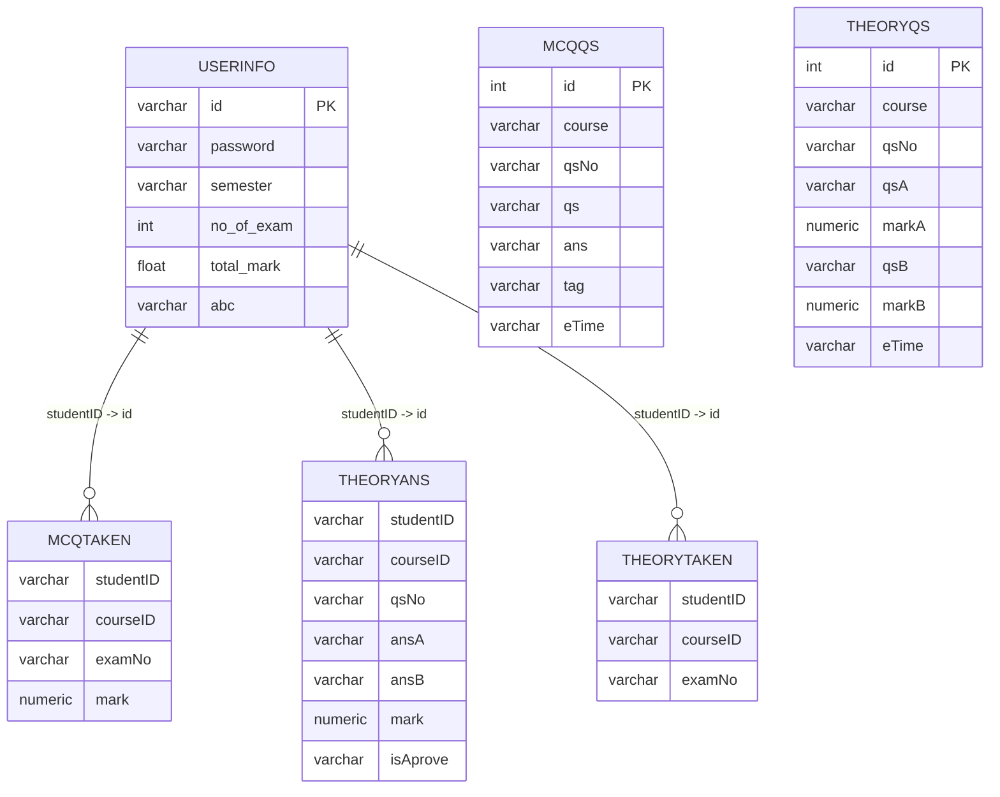
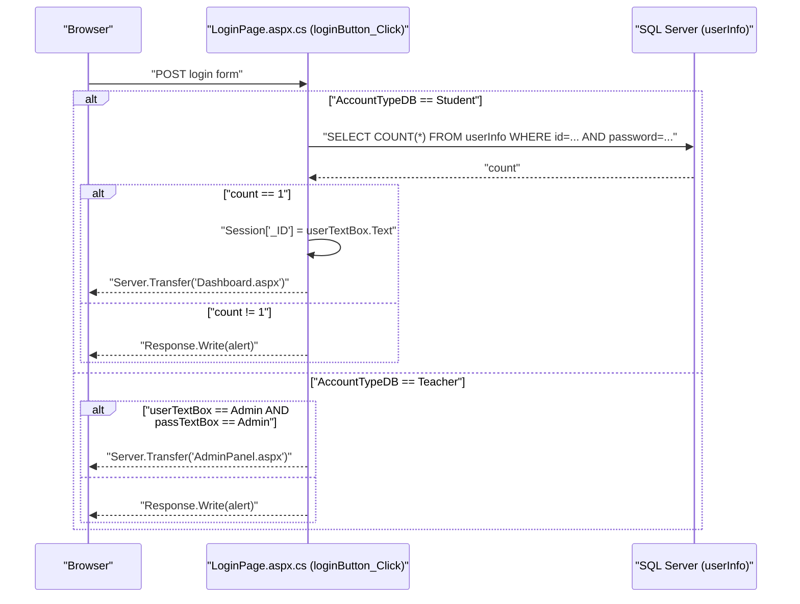
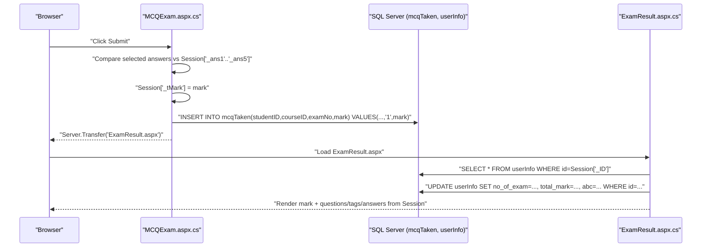
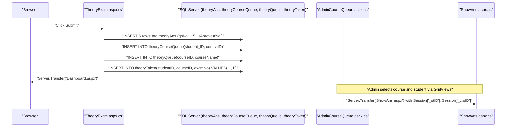

# Online Examination System (ASP.NET Web Forms) — Code-Derived Repository Documentation

## Scope and evidence policy

This document describes the repository strictly based on code and configuration files present in the repo. Every behavioral statement is tied to a concrete file path and, where applicable, a symbol or method name. When the code is incomplete or contradictory, that is explicitly stated rather than inferred.

Primary implementation lives under `Online-Examination-System-7216/OnlineExamSystem/` as a classic ASP.NET Web Forms application targeting .NET Framework 4.8 (`Online-Examination-System-7216/OnlineExamSystem/OnlineExamSystem.csproj`).

## Project purpose and functional scope

The repository implements an online examination system where:

1. Students can register and log in.
2. Students can start and take MCQ and theory exams.
3. MCQ exams are auto-scored and results are stored; theory exams are submitted for later manual marking by an admin/teacher workflow.
4. Students can view a leaderboard and their profile.

This scope is visible both in the high-level README (`Online-Examination-System-7216/README.md`) and in the concrete page-level code-behind implementation for login/registration/exams/queue/marking (for example: `LoginPage.aspx.cs`, `SignUpPage.aspx.cs`, `StartExam.aspx.cs`, `MCQExam.aspx.cs`, `TheoryExam.aspx.cs`, `ShowAns.aspx.cs`).

## Repository layout and main artifacts

### Solution and project

The repository contains one Visual Studio solution and one Web Forms project:

- `Online-Examination-System-7216/OnlineExamSystem.sln`
- `Online-Examination-System-7216/OnlineExamSystem/OnlineExamSystem.csproj`

The project is an ASP.NET Web Application project (`ProjectTypeGuids` includes the WebApplication GUID) with output type `Library` and target framework `v4.8` (`OnlineExamSystem.csproj`).

### Web Forms pages (UI + server-side logic)

The application is implemented as multiple `.aspx` pages with code-behind `.aspx.cs` handlers. The `.csproj` enumerates the pages as `Content` and the code-behind as `Compile` items.

Notable pages with server-side logic (non-exhaustive; derived from `.csproj` and code reads):

- Authentication & entry:
  - `Online-Examination-System-7216/OnlineExamSystem/LoginPage.aspx` and `LoginPage.aspx.cs`
  - `Online-Examination-System-7216/OnlineExamSystem/SignUpPage.aspx` and `SignUpPage.aspx.cs`

- Student features:
  - `Dashboard.aspx` and `Dashboard.aspx.cs` (navigation only; see `.csproj`, not read in this task)
  - `StartExam.aspx` and `StartExam.aspx.cs`
  - `MCQExam.aspx` and `MCQExam.aspx.cs`
  - `TheoryExam.aspx` and `TheoryExam.aspx.cs`
  - `ExamResult.aspx` and `ExamResult.aspx.cs`
  - `Leaderboard.aspx` and `Leaderboard.aspx.cs`
  - `UserProfile.aspx` and `UserProfile.aspx.cs`
  - `TakenCourses.aspx` and `TakenCourses.aspx.cs` (navigation only; not read in this task)

- Admin/teacher features:
  - `AdminPanel.aspx` and `AdminPanel.aspx.cs`
  - `SetExam.aspx` and `SetExam.aspx.cs` (navigation only; not read in this task)
  - `MCQSet.aspx` and `MCQSet.aspx.cs` (admin creates MCQ questions/exams)
  - `TheorySet.aspx` and `TheorySet.aspx.cs` (admin creates theory questions/exams)
  - `AdminQueue.aspx` and `AdminQueue.aspx.cs` (admin selects course queue)
  - `AdminCourseQueue.aspx` and `AdminCourseQueue.aspx.cs` (admin selects a student’s answer sheet to mark)
  - `ShowAns.aspx` and `ShowAns.aspx.cs` (admin views answers and submits marks)
  - `AdminLeaderboard.aspx` and `AdminLeaderboard.aspx.cs` (not read in this task; present in `.csproj`)

- PDF page (currently no active behavior):
  - `DownloadPdf.aspx` and `DownloadPdf.aspx.cs` (code contains commented-out iTextSharp usage; currently does nothing)

### Static assets and styling

- Bootstrap CSS under `Online-Examination-System-7216/OnlineExamSystem/CSS/bootstrap.css` (Bootswatch "morph" theme per file header).
- Images under `Online-Examination-System-7216/OnlineExamSystem/Images/` and `Online-Examination-System-7216/images/` (screenshots in root README).

### Database scripts

- `Online-Examination-System-7216/database-script/Online-Examination-System-Databse-Script.sql` (SQL Server database setup script; provided as a binary/base64-encoded file in this environment view, but it is clearly a SQL Server schema script and includes table names that match the code’s SQL statements.)
- `Online-Examination-System-7216/database-script/README.md`

## Build system, dependencies, and runtime prerequisites

### Target framework and compiler/runtime config

- The application targets `.NET Framework 4.8` (`TargetFrameworkVersion` in `OnlineExamSystem.csproj`).
- Web compilation is configured in `Web.config`:
  - `<compilation debug="true" targetFramework="4.8"/>`
  - `<httpRuntime targetFramework="4.5.2"/>`

The `system.codedom` section configures Roslyn CodeDom providers for C# and VB via `Microsoft.CodeDom.Providers.DotNetCompilerPlatform` (1.0.0.0) in `Web.config`.

### NuGet packages

Packages are declared in `Online-Examination-System-7216/OnlineExamSystem/packages.config`:

- `Microsoft.CodeDom.Providers.DotNetCompilerPlatform` version `1.0.0` (`targetFramework="net452"`)
- `Microsoft.Net.Compilers` version `1.0.0` (`developmentDependency="true"`)

The `.csproj` imports these packages from the `packages/` folder and will fail the build if the packages are missing (`EnsureNuGetPackageBuildImports` target in `OnlineExamSystem.csproj`). The repo includes a `packages/` directory with those packages.

### Other referenced assemblies

The `.csproj` references include:

- `CrystalDecisions.Web, Version=13.0.4000.0` (no hint path in project file; runtime availability depends on environment)
- Standard .NET assemblies: `System.Web`, `System.Data`, `System.Configuration`, etc.

Evidence: `Online-Examination-System-7216/OnlineExamSystem/OnlineExamSystem.csproj` `<Reference>` items.

## Configuration model

### web.config

`Online-Examination-System-7216/OnlineExamSystem/Web.config` contains:

- `system.web` compilation/runtime framework settings
- `system.codedom` compiler provider settings
- `connectionStrings`:

```xml
<connectionStrings>
  <add name="dbconnection" connectionString="your-database-connection-string"/>
  <add name="OnlineExamConnectionString" connectionString="your-database-connection-string" providerName="System.Data.SqlClient"/>
</connectionStrings>
```

However, the code-behind files largely do **not** use `ConfigurationManager.ConnectionStrings[...]` or `WebConfigurationManager.ConnectionStrings[...]`. Instead, many pages hardcode a string literal:

- `"your-database-connection-string"` appears repeatedly in:
  - `LoginPage.aspx.cs`
  - `SignUpPage.aspx.cs`
  - `StartExam.aspx.cs`
  - `MCQExam.aspx.cs`
  - `TheoryExam.aspx.cs`
  - `ExamResult.aspx.cs`
  - `ShowAns.aspx.cs`
  - `MCQSet.aspx.cs`
  - `TheorySet.aspx.cs`
  - `AdminCourseQueue.aspx.cs`
  - `Leaderboard.aspx.cs`

One notable exception is `UserProfile.aspx.cs`, which hardcodes a concrete SQL Server connection string including host, database, username and password:

```csharp
string CS = "Data Source=DESKTOP-JT5TE1G\\SQLEXPRESS;Initial Catalog=OnlineExam;Persist Security Info=True;User ID=sa;Password=369@saikat";
```

Evidence: `Online-Examination-System-7216/OnlineExamSystem/UserProfile.aspx.cs` in `Page_Load`.

### Environment variables

No `.env` is provided for this container per task metadata, and no code evidence was found in read files for `Environment.GetEnvironmentVariable` usage. Therefore, configuration appears to be expected via editing connection string literals and/or `Web.config`.

### Build configuration transforms

Transform templates exist:

- `Online-Examination-System-7216/OnlineExamSystem/Web.Debug.config`
- `Online-Examination-System-7216/OnlineExamSystem/Web.Release.config`

Both are stock transform examples; `Web.Release.config` removes the `debug` attribute from `<compilation>`, but neither defines any actual connection string transformations in this repository version.

## Runtime architecture (derived from code)

### System context

The system is a monolithic web application serving HTML pages (Web Forms) to browsers and interacting with a SQL Server database via ADO.NET `System.Data.SqlClient` from code-behind.

#### Context diagram (derived from `*.aspx.cs` DB usage and `Web.config` provider)

```mermaid
flowchart LR
  U["User (Student or Teacher/Admin)"] -->|HTTP(S) requests| W["ASP.NET Web Forms app (OnlineExamSystem)"]
  W -->|ADO.NET System.Data.SqlClient| DB["SQL Server database (OnlineExam)"]
```

**Derivation notes:**  
The web app is the `OnlineExamSystem` project (`OnlineExamSystem.csproj`) and uses `SqlConnection`, `SqlCommand`, `SqlDataAdapter`, `SqlDataReader` across multiple pages (for example `LoginPage.aspx.cs`, `StartExam.aspx.cs`, `MCQExam.aspx.cs`, `TheoryExam.aspx.cs`, `ShowAns.aspx.cs`). The database is SQL Server because the provider is `System.Data.SqlClient` in `Web.config` and the code uses `System.Data.SqlClient`.

### Container/component diagram (page-centric components)

Because this is Web Forms, the main “components” are pages with code-behind methods that implement actions and transitions via `Server.Transfer(...)`.



**Derivation notes:**  
Transfers are explicitly present in code-behind handlers:

- `LoginPage.signupB` transfers to `SignUpPage.aspx` (`LoginPage.aspx.cs`).
- `LoginPage.loginButton_Click` transfers to `Dashboard.aspx` (student) or `AdminPanel.aspx` (teacher/admin hardcoded) (`LoginPage.aspx.cs`).
- `StartExam.GridView1_SelectedIndexChanged` transfers to `TheoryExam.aspx`; `GridView2_SelectedIndexChanged` transfers to `MCQExam.aspx` (`StartExam.aspx.cs`).
- `MCQExam.submitB_Click` transfers to `ExamResult.aspx` (`MCQExam.aspx.cs`).
- `AdminQueue.aspx.cs` transfers to `AdminCourseQueue.aspx` via `GridView2_SelectedIndexChanged`.
- `AdminCourseQueue.aspx.cs` transfers to `ShowAns.aspx` via `GridView1_SelectedIndexChanged`.

### Database interaction style

The data access is implemented directly in page code-behind using dynamic SQL strings with concatenation and `SqlCommand`. There is no repository/ORM layer in the files inspected.

Evidence examples:
- `new SqlCommand("select count(*) from userInfo where id ='" + userTextBox.Text + "' ...", con);` in `LoginPage.loginButton_Click`.
- Many `insert into ... VALUES('"+ value +"', ...)` in `SignUpPage.signUpB_Click`, `MCQSet.AddQB_Click`, `TheoryExam.submitB_Click`, `MCQExam.submitB_Click`, etc.

## Data model (derived from code SQL statements and DB script table names)

The schema file is present at `Online-Examination-System-7216/database-script/Online-Examination-System-Databse-Script.sql` and appears to define tables referenced in the code. Even without decoding the full script text here, the table/column usage is unambiguous from the application SQL statements.

### Tables referenced by the application

From explicit SQL strings in code-behind:

- `userInfo`
  - Used in: `LoginPage.aspx.cs`, `SignUpPage.aspx.cs`, `StartExam.aspx.cs`, `ExamResult.aspx.cs`, `Leaderboard.aspx.cs`, `UserProfile.aspx.cs`
  - Columns referenced include: `id`, `password`, `semester`, `name`, `department`, `email`, `gender`, `fatherName`, `hall`, `image`, `no_of_exam`, `total_mark`, `abc`

- `mcqQS` (MCQ questions)
  - Used in: `StartExam.aspx.cs`, `MCQExam.aspx.cs`, `MCQSet.aspx.cs`
  - Columns referenced include: `course`, `qsNo`, `qs`, `op1`, `op2`, `op3`, `op4`, `ans`, `tag`, `eTime`/`etime`

- `mcqCourseDetail` (MCQ exams per course)
  - Used in: `MCQSet.aspx.cs` (`setB_Click` counts rows by `courseID` and inserts a new `examNo`)

- `mcqTaken` (MCQ submissions/results)
  - Used in: `StartExam.aspx.cs` (check if already taken), `MCQExam.aspx.cs` (insert mark)
  - Columns referenced include: `studentID`, `courseID`, `examNo`, `mark`

- `theoryQS` (theory questions)
  - Used in: `StartExam.aspx.cs`, `TheoryExam.aspx.cs`, `TheorySet.aspx.cs`
  - Columns referenced include: `course`, `qsNo`, `qsA`, `qsB`, `markA`, `markB`, `eTime`

- `theoryCourseDetail` (theory exams per course)
  - Used in: `TheorySet.aspx.cs` (`setB_Click` counts rows by `courseID` and inserts a new `examNo`)

- `theoryAns` (theory answer sheets)
  - Used in: `TheoryExam.aspx.cs` (insert answers), `ShowAns.aspx.cs` (read answers), `ShowAns.aspx.cs` (update mark + approval)
  - Columns referenced include: `studentID`, `courseID`, `qsNo`, `qsA`, `ansA`, `markA`, `isAprove`, `qsB`, `markB`, `ansB`, and `mark` (total mark) in `ShowAns.submitB_Click`

- `theoryTaken` (theory attempt record)
  - Used in: `StartExam.aspx.cs` (check if already taken), `TheoryExam.aspx.cs` (insert attempt)
  - Columns referenced include: `studentID`, `courseID`, `examNo`

- `theoryCourseQueue` (queue of students awaiting marking for a course)
  - Used in: `TheoryExam.aspx.cs` (insert), `AdminCourseQueue.aspx.cs` (count), `ShowAns.aspx.cs` (delete upon marking)
  - Columns referenced include: `student_ID`, `courseID`

- `theoryQueue` (admin-level queue per course)
  - Used in: `TheoryExam.aspx.cs` (insert course into queue), `AdminCourseQueue.aspx.cs` (delete course when empty)
  - Columns referenced include: `courseID`, `courseName`

### Entity-relationship sketch (inferred only from observed FK-like fields)

No explicit foreign keys were observed in code; the relationships below reflect how IDs are used in SQL statements.



**Derivation notes:**  
This diagram is derived from the identifier fields used in insert/select statements in:
- `MCQExam.aspx.cs` (`insert into mcqTaken (studentID,courseID,examNo,mark) ...`)
- `StartExam.aspx.cs` (checks `mcqTaken` and `theoryTaken` by `studentID`, `courseID`, `examNo`)
- `TheoryExam.aspx.cs` (`insert into theoryAns (...)`, then `insert into theoryTaken (...)`)
- `ShowAns.aspx.cs` (loads `theoryAns` by `studentID` and `courseID`)

## Public interfaces (as implemented)

This application exposes page-based HTTP endpoints (Web Forms). There is no evidence of Web API controllers in the inspected files; thus “public interface” is the set of `.aspx` pages and their server-side event handlers.

### Page endpoints and their key handlers

#### `LoginPage.aspx`

- Class: `OnlineExamSystem.LoginPage` (`LoginPage.aspx.cs`)
- Key handlers:
  - `signupB(object sender, EventArgs e)`: `Server.Transfer("SignUpPage.aspx", true);`
  - `loginButton_Click(object sender, EventArgs e)`:
    - If `AccountTypeDB.SelectedItem.Text == "Student"`: performs DB `select count(*) from userInfo where id=... and password=...`.
      - On success, sets `Session["_ID"]` and transfers to `Dashboard.aspx`.
      - On failure, uses `Response.Write("<script>alert(...);</script>")`.
    - If `AccountTypeDB.SelectedItem.Text == "Teacher"`: checks hardcoded credentials:
      - `userTextBox.Text == "Admin" && passTextBox.Text == "Admin"` then transfers to `AdminPanel.aspx`.

**Security-relevant note:** The Student login query is built by string concatenation (SQL injection risk) and stores passwords in plaintext comparison. Evidence: `LoginPage.aspx.cs`.

#### `SignUpPage.aspx`

- Class: `OnlineExamSystem.SignUpPage` (`SignUpPage.aspx.cs`)
- Key handlers:
  - `loginB_Click`: transfers to `LoginPage.aspx`.
  - `signUpB_Click`:
    - Validates `passTxBox.Text` equals `cPassTxBox.Text`.
    - Saves uploaded file to `~/Images/` via `FileUpload1.SaveAs(Server.MapPath("~/Images/") + Path.GetFileName(FileUpload1.FileName));`
    - Inserts a new record in `userInfo` with fields such as id/name/department/email/semester/gender/password/fatherName/hall/image/no_of_exam/total_mark.
    - On success, shows alert and transfers to `LoginPage.aspx`.

**Security-relevant note:** User-supplied fields are concatenated directly into SQL. Evidence: `SignUpPage.aspx.cs` `newcon` string.

#### `StartExam.aspx`

- Class: `OnlineExamSystem.StartExam` (`StartExam.aspx.cs`)
- Key behaviors:
  - `Page_Load`:
    - Requires `Session["_ID"] != null`, otherwise alerts and transfers to `LoginPage.aspx`.
    - On initial load (`!IsPostBack`), reads the student’s `semester` from `userInfo` and populates `SelectCourseDropDownList` with fixed course codes based on the `semester` string.
  - `startB_Click`:
    - Sets `Session["_Course"]` to selected course.
    - Sets `Session["_qsN"] = 1` (unused in some flows) and then checks selected exam type.
    - For `Theory`: queries `select count(*) from theoryQS where course=...`; if >=1 sets `Session["_sTCRS"]` to course; else alerts.
    - For `MCQ`: similarly checks `mcqQS` and sets `Session["_sMCRS"]`.
    - The actual transfers to `TheoryExam.aspx`/`MCQExam.aspx` in this handler are commented out; starting the exam is implemented in `GridView1_SelectedIndexChanged` and `GridView2_SelectedIndexChanged`.
  - `GridView1_SelectedIndexChanged` (theory exam selection):
    - Reads `exNo` and `crsNo` from selected grid row cells.
    - Checks if a row exists in `theoryTaken` for `(studentID, courseID, examNo)`.
    - If not taken, computes a starting question number:
      - `xx = (N - 1) * 2 + 1; Session["_qNO"] = xx;`
    - Transfers to `TheoryExam.aspx`.
  - `GridView2_SelectedIndexChanged` (MCQ exam selection):
    - Same pattern using `mcqTaken` and transfers to `MCQExam.aspx`.

**Behavioral note:** The exam number and question offset logic suggests that each “examNo” maps to a different range of questions, but `MCQExam.aspx.cs` currently always loads `qsNo` 1..5, not offset by `examNo`. This inconsistency is documented rather than resolved.

#### `MCQExam.aspx`

- Class: `OnlineExamSystem.MCQExam` (`MCQExam.aspx.cs`)
- Key behaviors:
  - `Page_Load`:
    - If `Session["_Course"] != null`, loads 5 questions from `mcqQS` with `qsNo` 1..5 for that course using 5 separate queries.
    - Stores question text/answer/tag into session keys: `_qs1.._qs5`, `_ans1.._ans5`, `_tag1.._tag5`.
    - Reads exam time `ET` from the `eTime` column of question 5 and on first load sets `Session["Timer"] = DateTime.Now.AddMinutes(examTime).ToString();`.
  - `submitB_Click`:
    - Compares selected options from RadioButtonLists against the correct answers stored in session.
    - Stores `Session["_tMark"] = mark;`
    - Inserts into `mcqTaken (studentID, courseID, examNo, mark)` with examNo hardcoded to `"1"`.
    - Transfers to `ExamResult.aspx`.
  - `Timer1_Tick`:
    - Displays time remaining by comparing `DateTime.Now` to `DateTime.Parse(Session["Timer"].ToString())`.
    - When time passes, sets label to `"Time Out!"` but does not auto-submit.

#### `ExamResult.aspx`

- Class: `OnlineExamSystem.ExamResult` (`ExamResult.aspx.cs`)
- Key behaviors:
  - `Page_Load`:
    - Displays mark from `Session["_tMark"]`.
    - Reads current user exam counters from `userInfo` (`no_of_exam` and `total_mark`), increments them, computes average (`Avg = totalMark / noOfExam`), and writes it back to `userInfo` column `abc`.
    - Displays the 5 question texts, tags, and correct answers from session `_qs1.._qs5`, `_tag1.._tag5`, `_ans1.._ans5`.

**Reliability note:** The code assumes session keys exist and does not null-check them before calling `.ToString()`, which can throw if the exam flow didn’t populate these sessions. Evidence: direct `.ToString()` usage throughout `ExamResult.aspx.cs`.

#### `TheoryExam.aspx`

- Class: `OnlineExamSystem.TheoryExam` (`TheoryExam.aspx.cs`)
- Key behaviors:
  - `Page_Load`:
    - Attempts to validate login with `if (Session["_ID"].ToString() == null)` which can throw if `_ID` is null. The intended behavior is to require login.
    - Uses `Session["_Course"]` and `Session["_qNo"]` to fetch five consecutive theory questions from `theoryQS`, incrementing the question number each time.
    - Reads `eTime` from the first fetched record and sets `Session["Timer"]` similarly to MCQ.
  - `submitB_Click`:
    - Inserts five rows into `theoryAns` (qsNo 1..5) capturing question text, student answers, per-part marks, and sets `isAprove` to `"No"`.
    - Inserts into `theoryCourseQueue (student_ID, courseID)`.
    - Inserts into `theoryQueue (courseID, courseName)` where `courseName` is derived by `getCourseName(courseID)` mapping known course IDs to human-readable names.
    - Inserts into `theoryTaken (studentID, courseID, examNo)` with examNo hardcoded `"1"`.
    - Alerts `"Your Answer Sheet Submited!"` and transfers to `Dashboard.aspx`.

#### Admin queue and marking pages

- `AdminPanel.aspx.cs`:
  - Mostly navigation via `Server.Transfer` to:
    - `AdminQueue.aspx`
    - `AdminLeaderboard.aspx`
    - `SetExam.aspx`
    - `EditExam.aspx`
    - `LoginPage.aspx` (logout)

- `AdminQueue.aspx.cs` (note: the class name in this file is `AdminCourseQueue`, despite being `AdminQueue.aspx.cs`):
  - `GridView2_SelectedIndexChanged`: stores selected course ID in `Session["_crsID1"]` and transfers to `AdminCourseQueue.aspx`.

- `AdminCourseQueue.aspx.cs` (note: the class name in this file is `AdminQueue`, despite being `AdminCourseQueue.aspx.cs`):
  - `Page_Load`: if `Session["_checkCID"]` exists, counts rows in `theoryCourseQueue` for that course; if empty, deletes that course from `theoryQueue`.
  - `GridView1_SelectedIndexChanged`: sets `Session["_stID"]` and `Session["_crsID"]` from grid row cells and transfers to `ShowAns.aspx`.

- `ShowAns.aspx.cs`:
  - `Page_Load`: loads the five theory answers for a student/course (qsNo 1..5) from `theoryAns` and displays them.
  - `submitB_Click`:
    - Parses teacher-entered per-part marks (A and B parts) from UI fields.
    - Computes a `total` mark; however the code assigns `total = a + b + c + d + ee;` and then immediately overwrites it with `total = a1 + b1 + c1 + d1 + ee1;`, meaning only the B-part total is persisted. This is a code fact, not an assumption.
    - Updates `theoryAns` setting `mark=total` and `isAprove='Yes'` for the student/course.
    - Deletes from `theoryCourseQueue` for the student/course.
    - Sets `Session["_checkCID"]` and transfers to `AdminCourseQueue.aspx`.

## Critical runtime flows (sequence diagrams)

### Student login flow

Derived from `OnlineExamSystem/LoginPage.aspx.cs` `loginButton_Click`.



### MCQ exam submission and scoring

Derived from `MCQExam.aspx.cs` `submitB_Click` and `ExamResult.aspx.cs` `Page_Load`.



### Theory exam submission to admin queue

Derived from `TheoryExam.aspx.cs` `submitB_Click` and admin queue pages.



## Session state and key session variables

The application relies heavily on ASP.NET Session state to carry identity and exam context:

- `Session["_ID"]`: student identifier (set in `LoginPage.loginButton_Click`, read across many pages)
- `Session["_Course"]`: selected course (set in `StartExam.startB_Click`)
- `Session["_qNO"]`: starting question number for theory/mcq exams computed in `StartExam.GridView*_SelectedIndexChanged` (note the code uses `_qNO` in `StartExam` but `TheoryExam` reads `Session["_qNo"]` with different casing; this mismatch is present in code and may cause runtime issues.)
- `Session["_qs1"... "_qs5"]`, `Session["_ans1"... "_ans5"]`, `Session["_tag1"... "_tag5"]`: MCQ question display and result rendering (`MCQExam` sets them; `ExamResult` reads them)
- `Session["_tMark"]`: total mark for MCQ result (`MCQExam` sets it; `ExamResult` reads it)
- Admin flow:
  - `Session["_crsID1"]`: course chosen by admin (`AdminQueue.aspx.cs`)
  - `Session["_stID"]`, `Session["_crsID"]`: student and course to mark (`AdminCourseQueue.aspx.cs`)
  - `Session["_checkCID"]`: course id used to check whether to delete admin queue course (`ShowAns.aspx.cs` sets it; `AdminCourseQueue.aspx.cs` reads it)

All of these are evidenced by direct reads/writes in the listed `.aspx.cs` files.

## Security behaviors and risks (strictly code-derived)

### Authentication and authorization

- Student authentication is implemented by querying `userInfo` with `id` and `password` and checking if `COUNT(*) == 1` (`LoginPage.aspx.cs`).
- Teacher/admin authentication is a hardcoded credential check: username `"Admin"` and password `"Admin"` (`LoginPage.aspx.cs`).
- Authorization is not role-based via ASP.NET Membership or FormsAuthentication configuration in `Web.config`. Instead, access control is implemented inconsistently by checking `Session["_ID"] != null` in some pages (for example `StartExam.aspx.cs`, `Leaderboard.aspx.cs`, `UserProfile.aspx.cs`) and not in others.
- No evidence of ASP.NET authorization sections in `Web.config` (the current `Web.config` contains only compilation/runtime and connectionStrings).

### Secrets handling

- Connection strings are hardcoded in many files as `"your-database-connection-string"`, and one file contains an explicit SQL Server username/password (`UserProfile.aspx.cs`).
- Because these values are in source, the repository contains secrets-like material (database password) in `UserProfile.aspx.cs` and should be treated as sensitive.

### Input handling and SQL injection exposure

- SQL statements are built using string concatenation of user input in multiple places:
  - `LoginPage.aspx.cs` concatenates `userTextBox.Text` and `passTextBox.Text` into a `SELECT COUNT(*)` query.
  - `SignUpPage.aspx.cs` concatenates registration inputs into an `INSERT`.
  - Multiple pages concatenate values from sessions and UI fields into `SELECT`, `INSERT`, `UPDATE`, and `DELETE` strings.
- There is no evidence of parameterized queries (`SqlParameter`) in the files inspected.

### File upload handling

- `SignUpPage.aspx.cs` saves uploaded files directly to `~/Images/` using `Path.GetFileName(FileUpload1.FileName)` and does not validate extension or content type in the shown code.

### Logging/auditing

- User-visible alerts are implemented via `Response.Write("<script>alert(...);</script>")` across pages.
- There is no evidence in inspected files of structured logging frameworks or persistent audit logs.

## Operational behaviors and edge cases observed in code

### Exam timing

- Both `MCQExam` and `TheoryExam` store a deadline in `Session["Timer"]` as a string and compute remaining time in `Timer1_Tick`.
- On timeout, the label shows `"Time Out!"` but the code does not auto-submit or disable inputs; commented-out blocks suggest intended behavior but not implemented.

Evidence:
- `OnlineExamSystem/MCQExam.aspx.cs` `Timer1_Tick`
- `OnlineExamSystem/TheoryExam.aspx.cs` `Timer1_Tick`

### Exam numbering

- MCQ and theory insertion into `mcqTaken` and `theoryTaken` currently hardcode `examNo` to `"1"` in:
  - `MCQExam.aspx.cs` `submitB_Click`
  - `TheoryExam.aspx.cs` `submitB_Click`

However, `StartExam.aspx.cs` uses `examNo` from grid row selection and checks `mcqTaken/theoryTaken` using that selected `examNo`. This discrepancy means the “already taken” check may not behave as intended when multiple exams exist per course.

### Theory marking total bug

`ShowAns.aspx.cs` `submitB_Click` overwrites the `total` variable:

```csharp
double total = a + b + c + d + ee;
total = a1 + b1 + c1 + d1 + ee1;
```

As written, only the B-part total is retained. This is a confirmed behavior from code, not speculation.

## Important code snippets (annotated)

### Student login query and session establishment

**File:** `Online-Examination-System-7216/OnlineExamSystem/LoginPage.aspx.cs`  
**Symbol:** `loginButton_Click(object sender, EventArgs e)`  

```csharp
SqlCommand cmd = new SqlCommand(
  "select count(*) from userInfo where id ='"
  + userTextBox.Text
  + "' and password='"
  + passTextBox.Text
  + "' ", con);

...
if (dt.Rows[0][0].ToString() == "1")
{
  Session["_ID"] = userTextBox.Text;
  Server.Transfer("Dashboard.aspx", true);
}
```

This code defines the student authentication mechanism and establishes the session identity key `_ID`.

### Registration saving uploaded image and inserting userInfo row

**File:** `Online-Examination-System-7216/OnlineExamSystem/SignUpPage.aspx.cs`  
**Symbol:** `signUpB_Click(object sender, EventArgs e)`  

```csharp
FileUpload1.SaveAs(Server.MapPath("~/Images/") + Path.GetFileName(FileUpload1.FileName));
string link = "Images/" + Path.GetFileName(FileUpload1.FileName);

string newcon =
  "insert into userInfo (id,name,department,email,semester,gender,password,fatherName,hall,image,no_of_exam,total_mark) " +
  "VALUES('" + idTxBox.Text + "', '" + nameTxBox.Text + "', ... , '" + link + "', '" + nEx + "', '" + tM + "')";
```

This code establishes where profile images are stored (`~/Images/`) and how user records are created.

### MCQ scoring and persistence

**File:** `Online-Examination-System-7216/OnlineExamSystem/MCQExam.aspx.cs`  
**Symbol:** `submitB_Click(object sender, EventArgs e)`  

```csharp
int mark = 0;
if (RadioButtonList1.SelectedIndex > -1 && RadioButtonList1.SelectedItem.Text == a1) { mark++; }
// ... repeated for 2..5
Session["_tMark"] = mark;

string newcon =
  "insert into mcqTaken (studentID,courseID,examNo,mark) VALUES('"
  + sNo + "','" + crsNo + "', '" + "1" + "', '" + M + "')";
```

This is the complete scoring algorithm for MCQ exams (count correct answers across five questions).

### Theory submission creates answer rows and queues

**File:** `Online-Examination-System-7216/OnlineExamSystem/TheoryExam.aspx.cs`  
**Symbol:** `submitB_Click(object sender, EventArgs e)`  

```csharp
string newcon =
  "insert into theoryAns (studentID,courseID,qsNo,qsA,ansA,markA,isAprove,qsB,markB,ansB) VALUES('"
  + stID + "', '" + crsID + "', '" + "1" + "', '" + qs1A.Text + "', '" + ans1ATB.Text + "', '" + m1A.Text + "','" + "No"
  + "', '" + qs1B.Text + "', '" + m1B.Text + "' ,'" + ans1BTB.Text + "')";

...
newcon = "insert into theoryCourseQueue (student_ID,courseID) VALUES('" + stID + "', '" + crsID + "')";
...
newcon = "insert into theoryQueue (courseID, courseName) VALUES('" + crsID + "', '" + courseNAME + "')";
...
newcon = "insert into theoryTaken (studentID,courseID,examNo) VALUES('" + sNo + "','" + crsNo + "', '" + eN + "')";
```

This code defines the “manual marking” workflow by storing the answer sheet and adding it to queues used by admin pages.

### Admin marking updates approval and removes from queue

**File:** `Online-Examination-System-7216/OnlineExamSystem/ShowAns.aspx.cs`  
**Symbol:** `submitB_Click(object sender, EventArgs e)`  

```csharp
string newcon =
  "update theoryAns set mark='" + total + "', isAprove='" + "Yes"
  + "' where studentID='" + sID + "' and courseID='" + cID + "';";

string newcon1 =
  "delete from theoryCourseQueue where student_ID='" + sID + "' and courseID='" + cID + "';";
```

This is the “marking completion” behavior; it makes the answer sheet approved and removes the student/course from the course queue.

## CI/CD and deployment evidence

No GitHub Actions workflows or other CI/CD configuration files were provided in the repository tree snapshot for this task. Therefore, no CI/CD pipeline diagram is included.

Deployment artifacts are typical for ASP.NET Web Forms: the project is designed to run under IIS/IIS Express. The `.csproj` includes IIS Express properties and an `IISUrl` for local dev (`http://localhost:55618/`), which suggests Visual Studio local hosting.

Evidence: `Online-Examination-System-7216/OnlineExamSystem/OnlineExamSystem.csproj` `<WebProjectProperties>`.

## How to run locally (derived from repo contents)

### Prerequisites

Based on the project targeting and SQL usage:

1. Visual Studio capable of building .NET Framework 4.8 Web Applications (or MSBuild with the appropriate web build targets).
2. .NET Framework 4.8 targeting pack installed.
3. SQL Server instance accessible to the web app.
4. NuGet restore capability (packages are included in `packages/` folder, but VS/MSBuild may still attempt restore depending on configuration).

Evidence:
- `TargetFrameworkVersion v4.8` (`OnlineExamSystem.csproj`)
- SQL Server via `System.Data.SqlClient` usage and DB script.
- NuGet packages in `packages.config`.

### Database setup

1. Create a SQL Server database consistent with the code and scripts.
2. Apply the schema from `Online-Examination-System-7216/database-script/Online-Examination-System-Databse-Script.sql`.

The code expects tables such as `userInfo`, `mcqQS`, `theoryQS`, `mcqTaken`, `theoryAns`, `theoryCourseQueue`, `theoryQueue`, `mcqCourseDetail`, `theoryCourseDetail`, `theoryTaken`. This list is derived from SQL strings inside the `.aspx.cs` files.

### Configure connection string(s)

This repository version uses hardcoded string literals in most pages, so local run typically requires replacing `"your-database-connection-string"` in all pages that use it, or changing code to read from `Web.config`.

Files that contain `"your-database-connection-string"` include:
- `OnlineExamSystem/LoginPage.aspx.cs`
- `OnlineExamSystem/SignUpPage.aspx.cs`
- `OnlineExamSystem/StartExam.aspx.cs`
- `OnlineExamSystem/MCQExam.aspx.cs`
- `OnlineExamSystem/TheoryExam.aspx.cs`
- `OnlineExamSystem/ExamResult.aspx.cs`
- `OnlineExamSystem/ShowAns.aspx.cs`
- `OnlineExamSystem/MCQSet.aspx.cs`
- `OnlineExamSystem/TheorySet.aspx.cs`
- `OnlineExamSystem/AdminCourseQueue.aspx.cs`
- `OnlineExamSystem/Leaderboard.aspx.cs`

Additionally, `OnlineExamSystem/UserProfile.aspx.cs` uses a hardcoded machine-specific connection string and would also need to be updated for your environment.

### Run steps (Visual Studio / IIS Express)

1. Open `Online-Examination-System-7216/OnlineExamSystem.sln` in Visual Studio.
2. Set `OnlineExamSystem` as the startup project.
3. Ensure the site runs (IIS Express) and navigate to the configured URL (the project file lists `http://localhost:55618/`).
4. Use `LoginPage.aspx` as an entry page (the repo includes it as content; default document configuration is not visible in provided `Web.config`, so the exact landing page depends on IIS settings).

## How to test (derived from repo contents)

No automated test projects, test frameworks, or test runner configurations were found in the repository tree snapshot. There is no evidence of MSTest/NUnit/xUnit projects, nor any `*.Tests.csproj`. Therefore, “How to test” is limited to manual, page-driven testing based on the implemented flows:

1. Registration:
   - Navigate to `SignUpPage.aspx`, register a user, verify a row exists in `userInfo` and that the image was saved under `OnlineExamSystem/Images/` (runtime path `~/Images/`).
2. Login:
   - Navigate to `LoginPage.aspx`, select “Student”, verify DB-backed login works.
   - Select “Teacher” and log in with `Admin`/`Admin` to access admin pages.
3. MCQ exam:
   - Ensure `mcqQS` contains at least 5 questions for a course.
   - Start exam via `StartExam.aspx` and submit answers; verify `mcqTaken` row and `userInfo` counters update.
4. Theory exam:
   - Ensure `theoryQS` contains questions for a course.
   - Start theory exam, submit; verify rows in `theoryAns`, `theoryCourseQueue`, and `theoryQueue`.
5. Admin marking:
   - Navigate admin queue pages, select a student/course, enter marks, submit; verify `theoryAns.isAprove` becomes `Yes`, `theoryCourseQueue` entry is deleted, and potentially `theoryQueue` is removed when empty (`AdminCourseQueue.aspx.cs`).

## Known inconsistencies and likely runtime issues (observed in code)

1. `Session["_qNO"]` vs `Session["_qNo"]` case mismatch:
   - `StartExam.aspx.cs` sets `Session["_qNO"]`, but `TheoryExam.aspx.cs` reads `Session["_qNo"]`.
   - This can cause `TheoryExam` to throw when casting `(int)Session["_qNo"]`.
2. Unsafe login check in `TheoryExam.Page_Load`:
   - `if (Session["_ID"].ToString() == null)` will throw if `_ID` is null.
3. Exam numbering inconsistencies:
   - `StartExam` checks `examNo` from grid, but `MCQExam` and `TheoryExam` insert `examNo` as `"1"` always.
4. `ShowAns` total mark logic overwrites A-part total with B-part total.

These issues are direct consequences of the current source code.

## Diagram applicability checklist (what is included and why)

- Included:
  - System/context diagram: justified by DB usage and web app nature.
  - Page/component diagram: justified by Web Forms page boundaries and `Server.Transfer` calls.
  - Sequence diagrams: justified by explicit handler logic for login, MCQ submission, theory queue/marking.

- Omitted:
  - CI/CD pipeline diagram: no CI/CD config was present in the visible repository structure.
  - Deployment diagram beyond IIS/IIS Express mention: no infrastructure-as-code or deployment descriptors found.
  - State machine diagram: no explicit state machine implementation found; the closest “state” is session variables, documented in the Session section.
  - Queue/topic/event diagrams: no message queue or event bus integrations found; “queues” are SQL tables (`theoryCourseQueue`, `theoryQueue`).

Task completed: Unified, code-derived repository documentation created with traceable file references, architecture diagrams, interfaces, configuration, data model, security behaviors, and run/test instructions.
