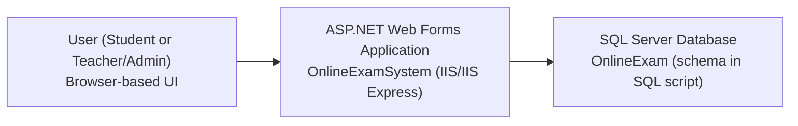
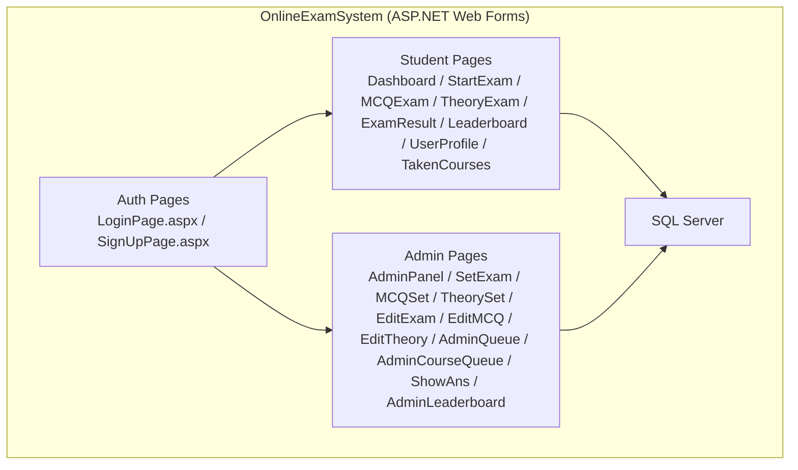
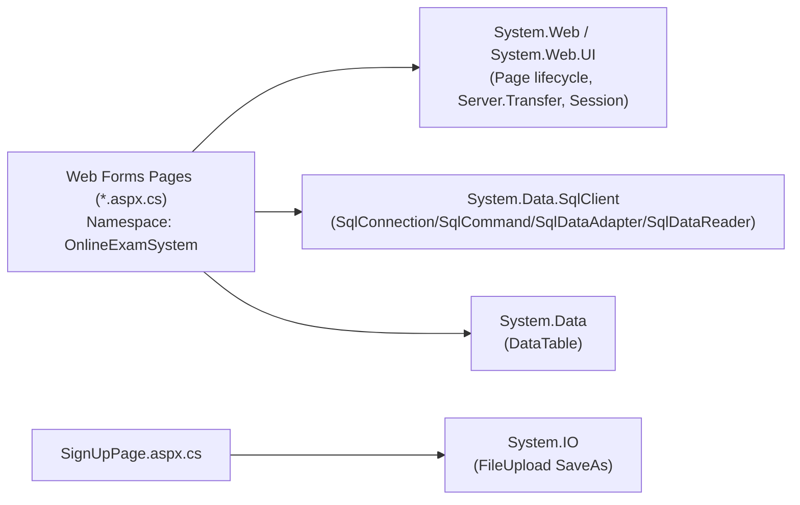
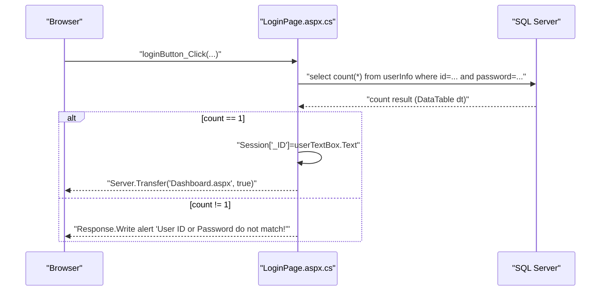
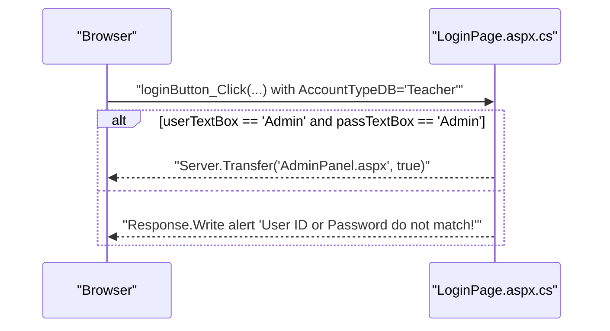
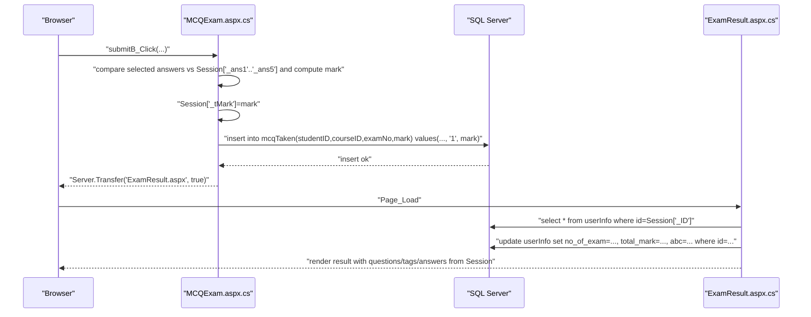
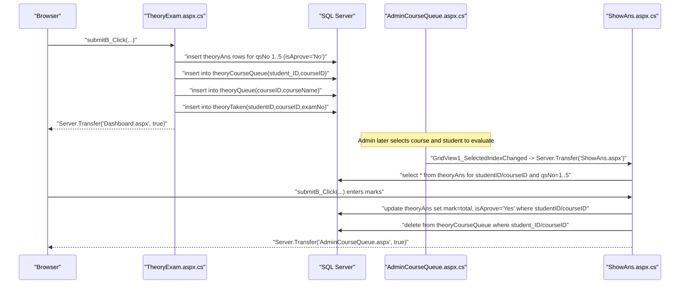
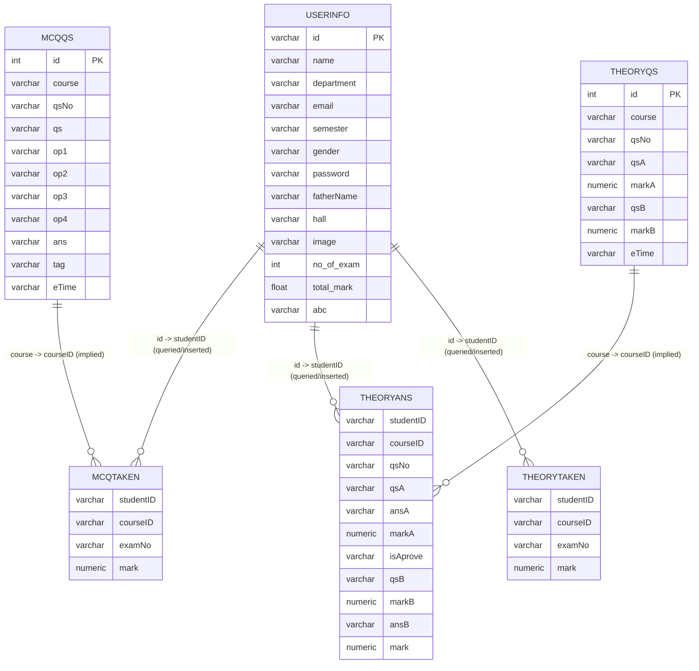
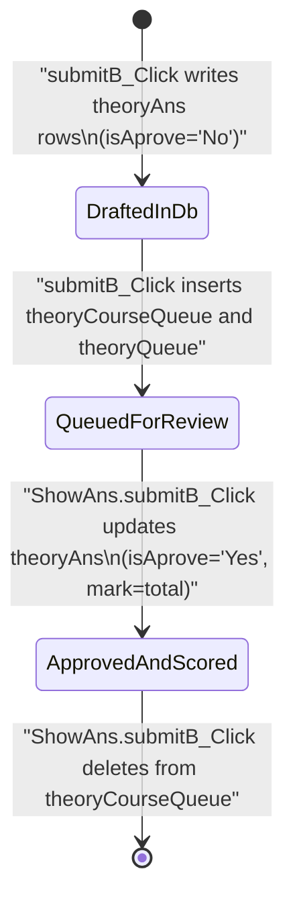
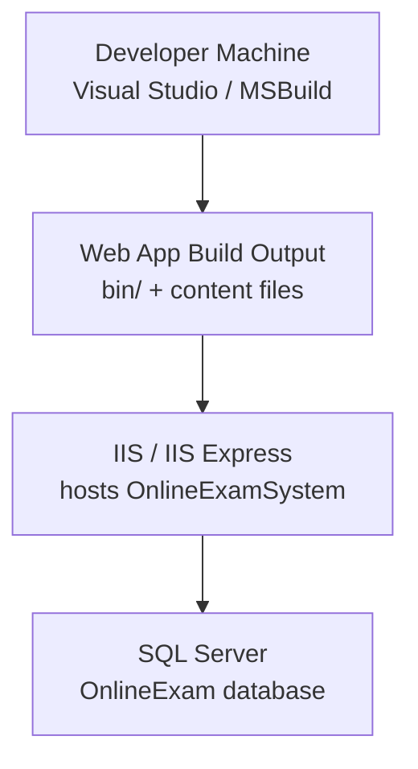

# Online Examination System (ASP.NET Web Forms) — Repository Code Documentation

## Scope and evidence policy

This document is regenerated strictly from the repository’s code and configuration files in `Online-Examination-System-7216/`. It documents only what is implemented in this repository (not what is typical for ASP.NET projects). Every major statement is traceable to concrete file paths and code identifiers.

A large portion of this application’s logic is implemented in ASP.NET Web Forms “page endpoints” (`.aspx` + `.aspx.cs` code-behind). There are no Web API controllers, no REST routes, and no background/scheduled jobs implemented in the code that was inspected.

## Repository purpose and high-level behavior

The repository contains a monolithic ASP.NET Web Forms application that supports two user roles:

1. Students can register, log in, start exams, take MCQ exams, submit theory answers, view their MCQ results, and view leaderboards.
2. Teachers/Admins (implemented as a hardcoded “Admin/Admin” credential) can access an admin panel to set exams and questions and to evaluate theory answer sheets via an admin queue.

The implemented entry points and user flows are page-based and rely heavily on ASP.NET `Session` variables and SQL Server tables.

Evidence:
- Student and teacher login behavior: `OnlineExamSystem/LoginPage.aspx.cs`, method `loginButton_Click`.
- Student registration: `OnlineExamSystem/SignUpPage.aspx.cs`, method `signUpB_Click`.
- Student exam selection and starting: `OnlineExamSystem/StartExam.aspx.cs`, methods `Page_Load`, `GridView1_SelectedIndexChanged`, `GridView2_SelectedIndexChanged`.
- MCQ exam taking and submission: `OnlineExamSystem/MCQExam.aspx.cs`, methods `Page_Load`, `submitB_Click`, `Timer1_Tick`.
- Theory exam taking and submission: `OnlineExamSystem/TheoryExam.aspx.cs`, methods `Page_Load`, `submitB_Click`, `Timer1_Tick`.
- MCQ result computation/persistence: `OnlineExamSystem/ExamResult.aspx.cs`, method `Page_Load`.
- Admin theory answer evaluation: `OnlineExamSystem/AdminQueue.aspx.cs`, `OnlineExamSystem/AdminCourseQueue.aspx.cs`, `OnlineExamSystem/ShowAns.aspx.cs`.

## Solution and project layout

### Top-level layout

- `OnlineExamSystem.sln`: Visual Studio solution.
- `OnlineExamSystem/OnlineExamSystem.csproj`: Web application project targeting .NET Framework 4.8.
- `OnlineExamSystem/*.aspx` and `OnlineExamSystem/*.aspx.cs`: Web Forms pages and their code-behind.
- `OnlineExamSystem/Web.config`: runtime configuration (compilation and connection strings).
- `database-script/Online-Examination-System-Databse-Script.sql`: SQL Server database schema script.

Evidence:
- Project and target framework: `OnlineExamSystem/OnlineExamSystem.csproj` (`<TargetFrameworkVersion>v4.8</TargetFrameworkVersion>`).
- Web.config: `OnlineExamSystem/Web.config`.
- DB script: `database-script/Online-Examination-System-Databse-Script.sql`.

### Module / namespace structure

All code-behind classes are in a single namespace:
- `namespace OnlineExamSystem` in each `.aspx.cs` file.

There is no separate domain layer, repository layer, or service layer in the inspected source. Database access is performed directly in pages using `System.Data.SqlClient` (e.g., `SqlConnection`, `SqlCommand`, `SqlDataAdapter`, `SqlDataReader`).

Evidence:
- Direct SQL access usage: `OnlineExamSystem/LoginPage.aspx.cs`, `SignUpPage.aspx.cs`, `StartExam.aspx.cs`, `MCQExam.aspx.cs`, `TheoryExam.aspx.cs`, `ExamResult.aspx.cs`, `ShowAns.aspx.cs`, `MCQSet.aspx.cs`, `TheorySet.aspx.cs`, `Leaderboard.aspx.cs`, `AdminCourseQueue.aspx.cs`.

## Architecture diagrams (evidence-backed)

### System context diagram

The system is a web application (ASP.NET Web Forms) that serves HTML pages to a user’s browser and connects to SQL Server.



Diagram mapping to code artifacts:
- The “ASP.NET Web Forms Application” node corresponds to the set of Web Forms pages and code-behind under `OnlineExamSystem/` (for example `LoginPage.aspx` + `LoginPage.aspx.cs`).
- The “SQL Server Database” node corresponds to the tables created by `database-script/Online-Examination-System-Databse-Script.sql` and accessed via `System.Data.SqlClient` in multiple pages (for example, `LoginPage.aspx.cs` queries `userInfo`).

### Container/component diagram (monolith)

The web app is a single container with multiple page endpoints. Admin and student features are implemented as separate pages, not separate services.



Diagram mapping to code artifacts:
- “Auth Pages” maps to `OnlineExamSystem/LoginPage.aspx.cs` and `OnlineExamSystem/SignUpPage.aspx.cs`.
- “Student Pages” maps to the student code-behind files, notably:
  - `Dashboard.aspx.cs`, `StartExam.aspx.cs`, `MCQExam.aspx.cs`, `TheoryExam.aspx.cs`, `ExamResult.aspx.cs`, `Leaderboard.aspx.cs`, `UserProfile.aspx.cs`, `TakenCourses.aspx.cs`.
- “Admin Pages” maps to the admin code-behind files, notably:
  - `AdminPanel.aspx.cs`, `SetExam.aspx.cs`, `MCQSet.aspx.cs`, `TheorySet.aspx.cs`, `EditExam.aspx.cs`, `EditMCQ.aspx.cs`, `EditTheory.aspx.cs`, `AdminQueue.aspx.cs`, `AdminCourseQueue.aspx.cs`, `ShowAns.aspx.cs`, `AdminLeaderboard.aspx.cs`.
- “SQL Server” maps to tables referenced from those pages, created by `database-script/Online-Examination-System-Databse-Script.sql`.

### Module dependency diagram (code-level)

This repository primarily consists of UI pages; dependencies are from pages to .NET base libraries (Web Forms and SQL client). There is no internal library layer.



Diagram mapping to code artifacts:
- `Pages` represents all `.aspx.cs` files under `OnlineExamSystem/`.
- `WebForms` is evidenced by `System.Web.UI.Page` inheritance and methods like `Server.Transfer(...)` and `Session[...]` in nearly all pages (example: `Dashboard.aspx.cs`).
- `SqlClient` is evidenced by `using System.Data.SqlClient;` and direct `SqlConnection` usage (example: `MCQExam.aspx.cs`).
- `IO` is evidenced by `FileUpload1.SaveAs(...)` in `SignUpPage.aspx.cs`.

## Public interfaces (implemented entry points)

### HTTP UI endpoints (page-based)

This application exposes Web Forms pages (not REST endpoints). Navigation is done via `Server.Transfer("X.aspx", true)`.

The following pages are directly referenced in code-behind as navigation targets:

#### Authentication
- `LoginPage.aspx`
  - Code-behind: `OnlineExamSystem/LoginPage.aspx.cs`
  - Key handlers:
    - `signupB(object sender, EventArgs e)`: transfers to `SignUpPage.aspx`.
    - `loginButton_Click(object sender, EventArgs e)`: authenticates Student vs Teacher and transfers to `Dashboard.aspx` or `AdminPanel.aspx`.

- `SignUpPage.aspx`
  - Code-behind: `OnlineExamSystem/SignUpPage.aspx.cs`
  - Key handlers:
    - `loginB_Click(...)`: transfers to `LoginPage.aspx`.
    - `signUpB_Click(...)`: inserts user record into `userInfo`, saves uploaded image, transfers to `LoginPage.aspx`.

#### Student pages
- `Dashboard.aspx` (`OnlineExamSystem/Dashboard.aspx.cs`)
  - `profileB_Click` -> `UserProfile.aspx`
  - `LeaderboardB_Click` -> `Leaderboard.aspx`
  - `sExamB_Click` -> `StartExam.aspx`
  - `logoutB_Click` -> `LoginPage.aspx`

- `StartExam.aspx` (`OnlineExamSystem/StartExam.aspx.cs`)
  - `Page_Load` validates `Session["_ID"]` and loads course list based on DB `userInfo.semester`.
  - `GridView1_SelectedIndexChanged` transfers to `TheoryExam.aspx` if not already taken.
  - `GridView2_SelectedIndexChanged` transfers to `MCQExam.aspx` if not already taken.

- `MCQExam.aspx` (`OnlineExamSystem/MCQExam.aspx.cs`)
  - `Page_Load` loads questions 1..5 from `mcqQS` for the selected course (`Session["_Course"]`).
  - `submitB_Click` inserts a row into `mcqTaken` and transfers to `ExamResult.aspx`.

- `TheoryExam.aspx` (`OnlineExamSystem/TheoryExam.aspx.cs`)
  - `Page_Load` loads a sequence of 5 questions from `theoryQS` starting at `Session["_qNo"]` and sets a timer.
  - `submitB_Click` writes answers into `theoryAns`, enqueues for admin evaluation (`theoryCourseQueue` and `theoryQueue`), inserts into `theoryTaken`, then transfers to `Dashboard.aspx`.

- `ExamResult.aspx` (`OnlineExamSystem/ExamResult.aspx.cs`)
  - Displays mark stored in `Session["_tMark"]`.
  - Updates `userInfo.no_of_exam`, `userInfo.total_mark`, and `userInfo.abc` (average) for the current user.
  - Displays the questions/tags/answers from `Session["_qs1"...]`, `Session["_tag1"...]`, `Session["_ans1"...]`.

- `Leaderboard.aspx` (`OnlineExamSystem/Leaderboard.aspx.cs`)
  - Reads current user’s `semester` and stores it in `Session["_Year"]`.
  - Logout sets `Session["_ID"] = "not"` and transfers to login (note this differs from other pages that just transfer).

- `UserProfile.aspx` (`OnlineExamSystem/UserProfile.aspx.cs`)
  - Loads user profile fields from `userInfo`.
  - `coursesB_Click` transfers to `TakenCourses.aspx`.

- `TakenCourses.aspx` (`OnlineExamSystem/TakenCourses.aspx.cs`)
  - Navigation only (home/profile/leaderboard/logout).

#### Admin pages
- `AdminPanel.aspx` (`OnlineExamSystem/AdminPanel.aspx.cs`)
  - `profileB_Click` -> `AdminQueue.aspx`
  - `LeaderboardB_Click` -> `AdminLeaderboard.aspx`
  - `sExamB_Click` -> `SetExam.aspx`
  - `eExamB_Click` -> `EditExam.aspx`
  - `logoutB_Click` -> `LoginPage.aspx`

- `SetExam.aspx` (`OnlineExamSystem/SetExam.aspx.cs`)
  - `theoryB_Click` -> `TheorySet.aspx`
  - `mcqB_Click` -> `MCQSet.aspx`

- `MCQSet.aspx` (`OnlineExamSystem/MCQSet.aspx.cs`)
  - `AddQB_Click` inserts into `mcqQS` and then computes the next question number by counting rows in `mcqQS`.
  - `setB_Click` increments exam number by counting rows in `mcqCourseDetail` for that course, then inserts into `mcqCourseDetail`.

- `TheorySet.aspx` (`OnlineExamSystem/TheorySet.aspx.cs`)
  - `AddQB_Click` inserts into `theoryQS` and then computes the next question number by counting rows in `theoryQS`.
  - `setB_Click` increments exam number by counting rows in `theoryCourseDetail` and inserts into `theoryCourseDetail`.

- `EditExam.aspx` (`OnlineExamSystem/EditExam.aspx.cs`)
  - Links to `EditTheory.aspx` and `EditMCQ.aspx` via `Server.Transfer`.

- `EditMCQ.aspx` (`OnlineExamSystem/EditMCQ.aspx.cs`)
  - Populates course dropdowns based on semester selection.
  - `searchB_Click` stores selected course to `Session["_CRS1"]`.
  - This file does not implement database edits itself; any editing behavior would be in markup or other code not present here.

- `EditTheory.aspx` (`OnlineExamSystem/EditTheory.aspx.cs`)
  - Similar to EditMCQ; `searchB_Click` stores course to `Session["_CRS"]`.
  - No implemented DB update logic in this code-behind file.

- `AdminQueue.aspx` (`OnlineExamSystem/AdminQueue.aspx.cs`)
  - `GridView2_SelectedIndexChanged` stores selected course ID into `Session["_crsID1"]` and transfers to `AdminCourseQueue.aspx`.

- `AdminCourseQueue.aspx` (`OnlineExamSystem/AdminCourseQueue.aspx.cs`)
  - `Page_Load` may delete a course from `theoryQueue` if the per-course student queue (`theoryCourseQueue`) is empty, using `Session["_checkCID"]`.
  - `GridView1_SelectedIndexChanged` stores `Session["_stID"]` and `Session["_crsID"]`, then transfers to `ShowAns.aspx`.

- `ShowAns.aspx` (`OnlineExamSystem/ShowAns.aspx.cs`)
  - Loads theory answers from `theoryAns` for `Session["_stID"]` and `Session["_crsID"]`.
  - `submitB_Click` updates the student’s theory mark and approval state and removes the student from `theoryCourseQueue`.

- `AdminLeaderboard.aspx` (`OnlineExamSystem/AdminLeaderboard.aspx.cs`)
  - Search button stores selected semester in `Session["_Year1"]`.
  - Database binding code is present but commented out in this code-behind.

- `DownloadPdf.aspx` (`OnlineExamSystem/DownloadPdf.aspx.cs`)
  - The PDF-generation code using iTextSharp is entirely commented out; no active PDF generation behavior is implemented.

## Critical flows (sequence diagrams with code mapping)

### Student login flow (Student account type)



Diagram mapping to code artifacts:
- Handler: `OnlineExamSystem/LoginPage.aspx.cs`, method `loginButton_Click`.
- Query: `SqlCommand cmd = new SqlCommand("select count(*) from userInfo ...", con);`.
- Session: `Session["_ID"] = userTextBox.Text;`.
- Navigation: `Server.Transfer("Dashboard.aspx", true);`.

Important code snippet (authentication logic with file path and role):
```csharp
// File: OnlineExamSystem/LoginPage.aspx.cs
// Symbol: LoginPage.loginButton_Click
if (AccountTypeDB.SelectedItem.Text == "Student")
{
    string CS = "your-database-connection-string";
    SqlConnection con = new SqlConnection(CS);
    con.Open();
    SqlCommand cmd = new SqlCommand(
        "select count(*) from userInfo where id ='" + userTextBox.Text +
        "' and password='" + passTextBox.Text + "' ", con);

    // ...
    if (dt.Rows[0][0].ToString() == "1")
    {
        Session["_ID"] = userTextBox.Text;
        Server.Transfer("Dashboard.aspx", true);
    }
}
```

### Teacher/Admin login flow (hardcoded)



Diagram mapping:
- `OnlineExamSystem/LoginPage.aspx.cs`, method `loginButton_Click` branch `else if (AccountTypeDB.SelectedItem.Text == "Teacher")`.

### Student starts an exam from StartExam grid and is prevented from retaking

This flow is implemented twice (for theory and MCQ) using different tables.

```mermaid
sequenceDiagram
  participant B as "Browser"
  participant S as "StartExam.aspx.cs"
  participant DB as "SQL Server"

  B->>S: "GridView*_SelectedIndexChanged"
  S->>S: "read examNo/courseID from selected row; studentID from Session['_ID']"
  S->>DB: "select count(*) from theoryTaken or mcqTaken where studentID/courseID/examNo match"
  DB-->>S: "count"
  alt count >= 1
    S-->>B: "alert 'You already take this exam!'"
  else count == 0
    S->>S: "compute start question index: xx=(examNo-1)*2+1; Session['_qNO']=xx"
    S-->>B: "Server.Transfer('TheoryExam.aspx' or 'MCQExam.aspx', true)"
  end
```

Diagram mapping:
- Theory: `OnlineExamSystem/StartExam.aspx.cs`, method `GridView1_SelectedIndexChanged` uses table `theoryTaken`.
- MCQ: `OnlineExamSystem/StartExam.aspx.cs`, method `GridView2_SelectedIndexChanged` uses table `mcqTaken`.
- Question number math is implemented in both handlers.

### MCQ exam submission and result



Diagram mapping:
- Mark computation and insert: `OnlineExamSystem/MCQExam.aspx.cs`, method `submitB_Click`.
- Result persistence and average update: `OnlineExamSystem/ExamResult.aspx.cs`, method `Page_Load`.

Note: `mcqTaken.examNo` is hardcoded as `"1"` in `MCQExam.submitB_Click`, even though exam selection passes an exam number earlier. This is a code-derived behavior.

### Theory exam submission and admin evaluation queueing



Diagram mapping:
- Theory submission: `OnlineExamSystem/TheoryExam.aspx.cs`, method `submitB_Click`.
- Admin selects student: `OnlineExamSystem/AdminCourseQueue.aspx.cs`, `GridView1_SelectedIndexChanged`.
- Admin views and updates: `OnlineExamSystem/ShowAns.aspx.cs`, methods `Page_Load`, `submitB_Click`.

Important code snippet (queueing behavior):
```csharp
// File: OnlineExamSystem/TheoryExam.aspx.cs
// Symbol: TheoryExam.submitB_Click
newcon = "insert into theoryCourseQueue (student_ID,courseID) VALUES('" + stID + "', '" + crsID + "')";
cmd = new SqlCommand(newcon, con);
cmd.ExecuteNonQuery();

string courseNAME = getCourseName(crsID);
newcon = "insert into theoryQueue (courseID, courseName) VALUES('" + crsID + "', '" + courseNAME + "')";
cmd = new SqlCommand(newcon, con);
cmd.ExecuteNonQuery();
```

## Data model (DB schema and application usage)

### Source of truth

The repository includes a SQL Server schema script:
- `database-script/Online-Examination-System-Databse-Script.sql`

The script content is stored in the repository and appears to include `CREATE TABLE` statements for tables that the application queries/inserts into. The runtime code references the following tables:

- `userInfo`
- `mcqQS`
- `mcqTaken`
- `mcqCourseDetail`
- `theoryQS`
- `theoryAns`
- `theoryTaken`
- `theoryCourseDetail`
- `theoryCourseQueue`
- `theoryQueue`

Evidence (table usage):
- `userInfo`: `LoginPage.aspx.cs`, `SignUpPage.aspx.cs`, `StartExam.aspx.cs`, `Leaderboard.aspx.cs`, `UserProfile.aspx.cs`, `ExamResult.aspx.cs`.
- `mcqQS`: `MCQExam.aspx.cs`, `MCQSet.aspx.cs`, `StartExam.aspx.cs`.
- `mcqTaken`: `MCQExam.aspx.cs`, `StartExam.aspx.cs`.
- `mcqCourseDetail`: `MCQSet.aspx.cs`.
- `theoryQS`: `TheoryExam.aspx.cs`, `TheorySet.aspx.cs`, `StartExam.aspx.cs`.
- `theoryAns`: `TheoryExam.aspx.cs`, `ShowAns.aspx.cs`.
- `theoryTaken`: `TheoryExam.aspx.cs`, `StartExam.aspx.cs`.
- `theoryCourseDetail`: `TheorySet.aspx.cs`.
- `theoryCourseQueue`: `TheoryExam.aspx.cs`, `AdminCourseQueue.aspx.cs`, `ShowAns.aspx.cs`.
- `theoryQueue`: `TheoryExam.aspx.cs`, `AdminCourseQueue.aspx.cs`.

### ER diagram (logical, as implied by code)

This ER diagram is based on the tables and the relationships implied by the code’s join keys (e.g., studentID/courseID) and the script table names. It does not assume foreign key constraints exist unless shown in code (the code uses matching IDs in queries).



Diagram mapping:
- `USERINFO` structure matches fields referenced in:
  - Insert: `SignUpPage.aspx.cs` inserts `id,name,department,email,semester,gender,password,fatherName,hall,image,no_of_exam,total_mark`.
  - Read: `UserProfile.aspx.cs` reads `name,id,department,semester,gender,email,fatherName,hall`.
  - Update: `ExamResult.aspx.cs` updates `no_of_exam,total_mark,abc`.
- `MCQQS` columns match fields read in `MCQExam.aspx.cs` (`qs`, `op1..op4`, `ans`, `tag`, `eTime`) and inserted in `MCQSet.aspx.cs` (`course,qsNo,qs,op1..op4,ans,tag,etime`).
- `THEORYQS` columns match fields read in `TheoryExam.aspx.cs` (`qsA,qsB,markA,markB,eTime`) and inserted in `TheorySet.aspx.cs`.
- `THEORYANS` columns match inserted columns in `TheoryExam.aspx.cs` and read/update columns in `ShowAns.aspx.cs`.

## State machine (key domain object)

### Theory answer sheet state (as implemented)

The repository implements an approval state for theory answers using the `theoryAns.isAprove` field and a queue table `theoryCourseQueue`.



State mapping to code artifacts:
- Transition to `DraftedInDb` and `QueuedForReview`:
  - `OnlineExamSystem/TheoryExam.aspx.cs`, method `submitB_Click` inserts into `theoryAns` with `isAprove='No'`, then inserts into `theoryCourseQueue` and `theoryQueue`.
- Transition to `ApprovedAndScored`:
  - `OnlineExamSystem/ShowAns.aspx.cs`, method `submitB_Click` updates `theoryAns set mark=..., isAprove='Yes'` and deletes from `theoryCourseQueue`.

## Configuration and environment

### Web.config settings (as shipped)

File: `OnlineExamSystem/Web.config`

Implemented settings:
- Compilation/debug:
  - `<compilation debug="true" targetFramework="4.8"/>`
  - `<httpRuntime targetFramework="4.5.2"/>`
- CodeDOM providers for Roslyn-based compilation:
  - `Microsoft.CodeDom.Providers.DotNetCompilerPlatform.*`
- Connection strings:
  - `dbconnection`: `connectionString="your-database-connection-string"`
  - `OnlineExamConnectionString`: `connectionString="your-database-connection-string"` with `providerName="System.Data.SqlClient"`

Important: Despite `Web.config` defining connection strings, most code-behind files do not read these configuration entries. Instead, many pages hardcode:
- `string CS = "your-database-connection-string";`

Evidence:
- `OnlineExamSystem/Web.config` connection strings section.
- Hardcoded connection strings in:
  - `LoginPage.aspx.cs`, `SignUpPage.aspx.cs`, `StartExam.aspx.cs`, `MCQExam.aspx.cs`, `TheoryExam.aspx.cs`, `ExamResult.aspx.cs`, `ShowAns.aspx.cs`, `MCQSet.aspx.cs`, `TheorySet.aspx.cs`, `Leaderboard.aspx.cs`, `AdminCourseQueue.aspx.cs`.

Exception:
- `UserProfile.aspx.cs` uses a different hardcoded connection string pointing to a specific machine/instance:
  - `Data Source=DESKTOP-JT5TE1G\\SQLEXPRESS;Initial Catalog=OnlineExam;Persist Security Info=True;User ID=sa;Password=369@saikat`

This is code-derived behavior and may require modification for other environments (see “Operational concerns”).

### Web.config transforms

- `OnlineExamSystem/Web.Debug.config`: template comments only; no active transforms.
- `OnlineExamSystem/Web.Release.config`: removes compilation debug attribute via:
  - `<compilation xdt:Transform="RemoveAttributes(debug)" />`

Evidence:
- `OnlineExamSystem/Web.Debug.config`
- `OnlineExamSystem/Web.Release.config`

### Environment variables

No `.env` file is present in the provided repository structure, and no environment variable usage was observed in the inspected code-behind. The application’s database connectivity is controlled via hardcoded strings and/or `Web.config` connection strings.

## Dependencies

### NuGet packages (packages.config)

File: `OnlineExamSystem/packages.config`
- `Microsoft.CodeDom.Providers.DotNetCompilerPlatform` version `1.0.0`
- `Microsoft.Net.Compilers` version `1.0.0` (developmentDependency)

Evidence:
- `OnlineExamSystem/packages.config`

### Assembly references (csproj)

File: `OnlineExamSystem/OnlineExamSystem.csproj`
Notable references include:
- `System.Web`, `System.Data`, `System.Configuration`, etc.
- `CrystalDecisions.Web` (referenced, but no Crystal Reports code usage was observed in the inspected code-behind).
- `Microsoft.CodeDom.Providers.DotNetCompilerPlatform` (NuGet).

Evidence:
- `<Reference Include="CrystalDecisions.Web, Version=13.0.4000.0, ..."/>` in `OnlineExamSystem.csproj`.

### External integrations

The only active external integration observed is SQL Server via `System.Data.SqlClient`.

There is commented-out code for PDF generation via iTextSharp in:
- `OnlineExamSystem/DownloadPdf.aspx.cs`
However, iTextSharp namespaces are commented and not included as packages in `packages.config`.

## Security behaviors (as implemented)

### Authentication and authorization

Authentication is implemented with:
- Student login: a SQL query that checks `userInfo.id` and `userInfo.password` and sets `Session["_ID"]` on success.
- Teacher/admin login: a hardcoded check for username/password `Admin`/`Admin`.

Authorization is primarily “soft” and page-based:
- Many student pages check `Session["_ID"] != null` and redirect to login if missing (examples: `StartExam.aspx.cs`, `Leaderboard.aspx.cs`, `UserProfile.aspx.cs`).
- Admin pages shown do not consistently enforce an admin session/role check; access control is mostly via navigation from login.

Evidence:
- Student login: `OnlineExamSystem/LoginPage.aspx.cs`, `loginButton_Click`.
- Admin login: same method, teacher branch.
- Session checks:
  - `StartExam.aspx.cs` checks `if (Session["_ID"] != null)`.
  - `Leaderboard.aspx.cs` checks `if (Session["_ID"] != null)`.
  - `UserProfile.aspx.cs` checks `if (Session["_ID"] != null)`.
- In contrast, `TheoryExam.aspx.cs` contains `if (Session["_ID"].ToString() == null)` which can throw if `_ID` is null; this is a code-level risk rather than an intended security feature.

### Secrets handling

Database credentials are embedded directly in code in at least one file:
- `OnlineExamSystem/UserProfile.aspx.cs` contains a full SQL Server connection string with `User ID=sa;Password=...`.

Elsewhere, placeholder values are hardcoded:
- `string CS = "your-database-connection-string";`

Evidence:
- `UserProfile.aspx.cs`, `Page_Load` assigns `CS = "Data Source=...;User ID=sa;Password=..."`.

### Input validation and injection safety

The application constructs SQL statements via string concatenation of user-controlled inputs (e.g., user ID, password, textboxes). There is no parameterization (`SqlParameter`) in the inspected code.

This implies SQL injection risk as implemented.

Evidence:
- `LoginPage.aspx.cs`, query string includes `userTextBox.Text` and `passTextBox.Text` concatenated into SQL.
- `SignUpPage.aspx.cs`, insert statement concatenates multiple textbox values.
- Similar patterns exist in `MCQSet.aspx.cs`, `TheorySet.aspx.cs`, `TheoryExam.aspx.cs`, `ShowAns.aspx.cs`.

### File upload handling

Registration saves the uploaded file to `~/Images/` and stores the relative link in the database. The code does not implement file type validation or sanitization in the inspected method.

Evidence:
- `OnlineExamSystem/SignUpPage.aspx.cs`, method `signUpB_Click`:
  - `FileUpload1.SaveAs(Server.MapPath("~/Images/") + Path.GetFileName(FileUpload1.FileName));`
  - `string link = "Images/" + Path.GetFileName(FileUpload1.FileName);`

### Logging/auditing

There is no structured logging framework usage in the inspected code. Errors are sometimes surfaced to the user via `Response.Write("<script>alert(...)")`.

Evidence:
- `LoginPage.aspx.cs` catch block: `Response.Write("<script>alert(ex.Message);</script>");`

## Operational concerns and failure handling (code-derived)

### Database connectivity and reliability

Database connections are opened/closed manually; error handling varies:
- Some pages wrap DB operations in try/catch (e.g., login), but others do not.
- No retry logic or timeouts are configured explicitly in code.

Evidence:
- Try/catch in `LoginPage.aspx.cs` around DB open/query.
- No try/catch in `TheorySet.aspx.cs` `AddQB_Click` (direct insert).
- No explicit command timeout usage anywhere in inspected code.

### Session dependence

The application uses `Session` as its primary state mechanism across pages. Important session keys include:
- `_ID` (logged-in student ID): set in `LoginPage.loginButton_Click`, required by many pages.
- `_Course` (selected course for exam): set in `StartExam.startB_Click`.
- `_qNO` (start question number for theory/MCQ sequence): set in `StartExam.GridView*_SelectedIndexChanged`.
- `_tMark`, `_qs1.._qs5`, `_ans1.._ans5`, `_tag1.._tag5`: set in `MCQExam.Page_Load` and `MCQExam.submitB_Click`, read in `ExamResult.Page_Load`.
- Admin evaluation flow:
  - `_crsID1` (selected course in admin queue): set in `AdminQueue.GridView2_SelectedIndexChanged`.
  - `_stID`, `_crsID` (selected student/course): set in `AdminCourseQueue.GridView1_SelectedIndexChanged`.
  - `_checkCID` (used to check if a course queue is empty and delete from `theoryQueue`): set in `ShowAns.submitB_Click`.

Evidence:
- `LoginPage.aspx.cs`, `Session["_ID"] = userTextBox.Text;`.
- `StartExam.aspx.cs`, `Session["_Course"] = SelectCourseDropDownList.Text;`, `Session["_qNO"] = xx;`.
- `MCQExam.aspx.cs`, sets `Session["_qs1"]`, `Session["_ans1"]`, `Session["_tag1"]`, etc.
- `ExamResult.aspx.cs`, reads `Session["_qs1"]`, `Session["_tag1"]`, `Session["_ans1"]`, etc.
- `AdminQueue.aspx.cs`, `Session["_crsID1"] = row.Cells[1].Text;`.
- `AdminCourseQueue.aspx.cs`, `Session["_stID"]` and `Session["_crsID"]`.
- `ShowAns.aspx.cs`, `Session["_checkCID"] = cID;`.

### Timer behavior

Both MCQ and theory exams implement a countdown timer based on `Session["Timer"]`:
- Timer is set on initial (non-postback) load as `DateTime.Now.AddMinutes(examTime).ToString()`.
- On each timer tick, the remaining time is computed and displayed.
- When time is over, the code sets label to “Time Out!” but does not automatically submit or redirect.

Evidence:
- `MCQExam.aspx.cs`, `Page_Load` sets `Session["Timer"]` and `Timer1_Tick` compares times.
- `TheoryExam.aspx.cs`, `Page_Load` sets `Session["Timer"]` and `Timer1_Tick` compares times.

## Build, run, and test (commands derived from repo)

### Prerequisites (implied by project files)

- Visual Studio (or MSBuild) capable of building ASP.NET Web Application projects targeting .NET Framework 4.8.
- .NET Framework 4.8 targeting pack installed (project targets `v4.8`).
- IIS Express or IIS for hosting (project file includes IIS Express settings).
- SQL Server (the code uses `System.Data.SqlClient` and schema script is for SQL Server).

Evidence:
- Target framework: `OnlineExamSystem/OnlineExamSystem.csproj`.
- IIS Express settings: `OnlineExamSystem/OnlineExamSystem.csproj` under `<WebProjectProperties>` (e.g., `IISUrl` and `DevelopmentServerPort`).
- SQL Server schema: `database-script/Online-Examination-System-Databse-Script.sql`.

### Database setup (schema script)

1. Create a SQL Server database (the script suggests a database named `OnlineExam`).
2. Run the schema script:
   - `database-script/Online-Examination-System-Databse-Script.sql`

Evidence:
- The script begins with `CREATE DATABASE [OnlineExam]` (present in the script content).

### Configure database connection for the app

As shipped, the code uses placeholder strings in many pages:
- `string CS = "your-database-connection-string";`

To run successfully, you must set a real SQL Server connection string in the code paths that are used, or refactor to read `Web.config` connection strings (not implemented currently).

Additionally, `UserProfile.aspx.cs` contains a machine-specific hardcoded connection string and will likely fail unless it matches your environment.

Evidence:
- Hardcoded placeholder: multiple `.aspx.cs` files (see “Configuration”).
- Machine-specific connection: `OnlineExamSystem/UserProfile.aspx.cs`.

### Running locally (Visual Studio/IIS Express)

The repository does not include CLI scripts; standard Web Forms workflow is implied by `.sln` and `.csproj`:

1. Open `OnlineExamSystem.sln` in Visual Studio.
2. Restore NuGet packages for the solution (packages are in `OnlineExamSystem/packages.config` and under `packages/`).
3. Build the solution.
4. Run the web project (`OnlineExamSystem`) using IIS Express (enabled in `OnlineExamSystem/OnlineExamSystem.csproj`: `<UseIISExpress>true</UseIISExpress>`).
5. The project file indicates an IIS URL such as `http://localhost:55618/` in `<IISUrl>`.

Evidence:
- `OnlineExamSystem/OnlineExamSystem.csproj` includes:
  - `<UseIISExpress>true</UseIISExpress>`
  - `<IISUrl>http://localhost:55618/</IISUrl>`

### How to test

This repository does not contain automated test projects (no `*.Tests.csproj` and no test framework references were observed in the inspected files). Therefore, testing is manual through the UI.

Manual test flows (code-derived):
- Student registration:
  - Navigate to `LoginPage.aspx`, click signup (`LoginPage.signupB`), fill `SignUpPage` fields, upload image, submit (`SignUpPage.signUpB_Click`) and verify insert into `userInfo`.
- Student login:
  - `LoginPage.loginButton_Click` (Student type) sets `Session["_ID"]` on success.
- MCQ exam:
  - From `Dashboard.aspx` -> `StartExam.aspx` -> choose course and select an MCQ exam row -> `MCQExam.aspx` -> submit -> `ExamResult.aspx`.
- Theory exam and admin marking:
  - From `StartExam.aspx` -> choose theory exam row -> `TheoryExam.aspx` -> submit -> admin logs in -> `AdminQueue.aspx` -> `AdminCourseQueue.aspx` -> select student -> `ShowAns.aspx` -> mark and submit.

Evidence:
- Handlers and navigation listed in “Public interfaces”.

## Deployment model (as implied by code)

There is no containerization, no infrastructure-as-code, and no CI/CD pipeline configuration files visible in the provided repository listing. Deployment is therefore inferred as a classic IIS deployment of an ASP.NET Web Forms application.



Diagram mapping:
- Build output path: `OnlineExamSystem/OnlineExamSystem.csproj` sets `<OutputPath>bin\</OutputPath>`.
- Hosting: `.csproj` contains IIS Express settings; Web Forms is typically hosted on IIS (this is consistent with project type GUIDs and web application targets).
- DB: schema script + `SqlClient` usage.

## CI/CD pipeline

No CI/CD configuration was found in the inspected repository files (no GitHub Actions, Azure Pipelines, etc., were referenced in the provided tree). Therefore, there is no code-justified CI/CD pipeline diagram to include.

## Notable implementation details and limitations (code-derived)

### Exams and question counts

MCQ:
- `MCQExam.aspx.cs` loads exactly 5 questions (qsNo 1..5) for the selected course.
- The computed `mark` increments by 1 per correct answer.

Theory:
- `TheoryExam.aspx.cs` loads 5 questions but in pairs (A/B) per question record and uses `_qNo` to select a starting question number, incrementing for each subsequent question loaded.
- Submission inserts 5 rows into `theoryAns` with `qsNo` hardcoded as 1..5 in the insert statements, independent of `_qNo`.

Evidence:
- `MCQExam.aspx.cs` contains 5 repeated blocks selecting qsNo '1'..'5'.
- `TheoryExam.aspx.cs` loads five question records by incrementing `qN` and querying `theoryQS` by `qsNo`.
- `TheoryExam.submitB_Click` inserts `qsNo` values `"1"`..`"5"`.

### Admin queue maintenance

`AdminCourseQueue.aspx.cs` conditionally deletes a course from `theoryQueue` if there are no remaining students for that course in `theoryCourseQueue`. The delete is triggered when `Session["_checkCID"]` is set (by `ShowAns.submitB_Click`).

Evidence:
- `OnlineExamSystem/AdminCourseQueue.aspx.cs`, `Page_Load`.
- `OnlineExamSystem/ShowAns.aspx.cs`, `submitB_Click` sets `Session["_checkCID"] = cID;`.

### PDF export

The `DownloadPdf.aspx.cs` page contains only commented-out code for PDF generation. As implemented, it performs no work.

Evidence:
- `OnlineExamSystem/DownloadPdf.aspx.cs`, `Page_Load` contains a large commented block including `iTextSharp` usage.

## Traceability index (key files)

### Core configuration and build
- `OnlineExamSystem/OnlineExamSystem.csproj` — project definition, .NET framework target, IIS Express settings, references.
- `OnlineExamSystem/Web.config` — compilation settings and connection string placeholders.
- `OnlineExamSystem/packages.config` — NuGet packages.

### Database schema
- `database-script/Online-Examination-System-Databse-Script.sql` — SQL Server schema definitions for the tables used by the application.

### Authentication
- `OnlineExamSystem/LoginPage.aspx.cs` — login logic for students and hardcoded teacher/admin.
- `OnlineExamSystem/SignUpPage.aspx.cs` — registration and file upload.

### Student exam flow
- `OnlineExamSystem/Dashboard.aspx.cs`
- `OnlineExamSystem/StartExam.aspx.cs`
- `OnlineExamSystem/MCQExam.aspx.cs`
- `OnlineExamSystem/TheoryExam.aspx.cs`
- `OnlineExamSystem/ExamResult.aspx.cs`
- `OnlineExamSystem/Leaderboard.aspx.cs`
- `OnlineExamSystem/UserProfile.aspx.cs`
- `OnlineExamSystem/TakenCourses.aspx.cs`

### Admin flow
- `OnlineExamSystem/AdminPanel.aspx.cs`
- `OnlineExamSystem/SetExam.aspx.cs`
- `OnlineExamSystem/MCQSet.aspx.cs`
- `OnlineExamSystem/TheorySet.aspx.cs`
- `OnlineExamSystem/EditExam.aspx.cs`
- `OnlineExamSystem/EditMCQ.aspx.cs`
- `OnlineExamSystem/EditTheory.aspx.cs`
- `OnlineExamSystem/AdminQueue.aspx.cs`
- `OnlineExamSystem/AdminCourseQueue.aspx.cs`
- `OnlineExamSystem/ShowAns.aspx.cs`
- `OnlineExamSystem/AdminLeaderboard.aspx.cs`

## Instructions for future agent

If deeper data-model documentation is required (for example, listing every column type and constraint from the SQL script), the SQL script is currently stored in a form that was read as a binary/base64 blob by tooling. A future agent should decode and re-read `database-script/Online-Examination-System-Databse-Script.sql` as text (using an approach that preserves its original encoding) to extract the complete schema verbatim, then update the ER section accordingly.
